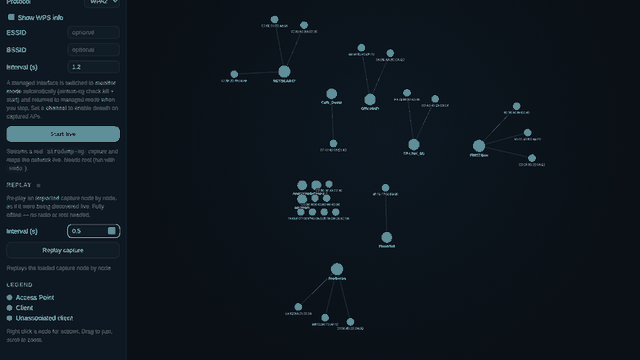

<div align="center">
  
  <p><em>A simplified tool for fast Wi-Fi penetration testing, and an easy starting point for beginners.</em></p>
</div>


## Quick start

```bash
git clone https://github.com/0xPR3ST1JH0NN7/WiFiCatcher
cd WiFiCatcher

# system tools used for live capture + deauth (skip if you only import/replay)
sudo apt install aircrack-ng tshark

# python dependencies
python3 -m venv .venv && source .venv/bin/activate
pip install -r requirements.txt
```

## Run

Run without `sudo` for offline use, or with `sudo` to unlock live capture:

```bash
python3 -m WiFiCatcher          # http://127.0.0.1:8000  (offline: import & replay)
         OR
sudo python3 -m WiFiCatcher     # also enables live capture + deauth
```

Press **Enter** (or Ctrl+C) in the terminal to stop.

## What it does

- **Graph & table views** of APs, clients and associations. Search, sort and filter by type, encryption or channel.
- **Import & replay** a saved `airodump-ng` CSV.
- **Live capture** a real `airodump-ng` stream and watch the map build in real time.
- **WPA2-Enterprise:** flags 802.1X APs, inspects/exports the RADIUS certificate, and enumerates accepted EAP methods.
- Offline vendor lookup from the OUI database.

## Replay

Import a saved capture, then hit **Replay** to watch the whole scan rebuild node by node, as if it were being discovered live. Fully offline: no radio, no root.



## Live capture

Needs root (`sudo`). Pick a wireless adapter; a managed one is switched to monitor mode automatically and restored when you stop. Set a channel, band or filters, then **Start live capture**.


WiFiCatcher checks its dependencies on startup and won't start if a required tool is missing (bypass with `--skip-checks` for offline-only use).

> ⚠️ Use WiFiCatcher only on networks you own or are authorized to test.

## Credits

- EAP method enumeration bundles [EAP_buster](https://github.com/blackarrowsec/EAP_buster) by BlackArrow (MIT).
- Authors: [@0xPR3ST1JH0NN7](https://github.com/0xPR3ST1JH0NN7), [@tvasari](https://github.com/tvasari)
