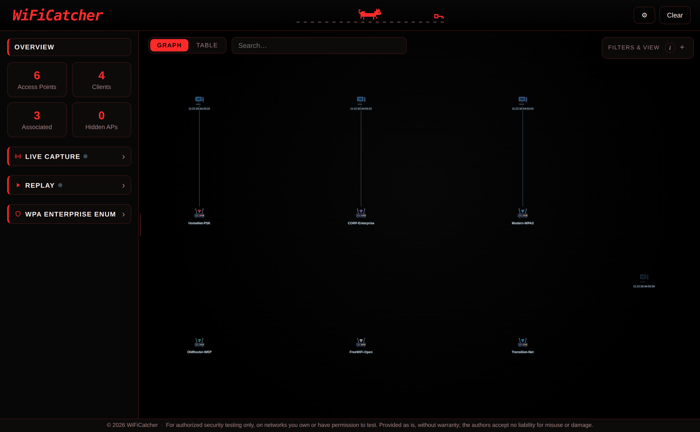

<div align="center">
  
  <p><em>A simplified tool for fast Wi-Fi assessment.</em></p>
</div>

WiFiCatcher was born to make Wi-Fi assessment faster and to make life easier for newcomers. Under the hood it is a wrapper around the best-known tools already out there, bringing them together behind one simple, visual interface.

## Hardware requirements

Some features (live capture and deauthentication) need a Wi-Fi adapter that supports monitor mode and packet injection, which many built-in laptop adapters do not; a compatible external adapter is usually the safe choice. Everything else works on any machine, since it reads a capture file rather than the radio.

## Quick start

```bash
git clone https://github.com/0xPR3ST1JH0NN7/WiFiCatcher
cd WiFiCatcher

# system dependencies
sudo apt install aircrack-ng tshark wpasupplicant

# python dependencies (the app runs from this venv)
python3 -m venv .venv && source .venv/bin/activate
pip install -r requirements.txt

# install the privileged warden (once)
sudo ./packaging/install-warden.sh
```

## How it runs

WiFiCatcher itself is a normal, unprivileged app. The few operations that need root (putting the adapter into monitor mode, running airodump-ng and aireplay-ng, restoring NetworkManager afterwards) are delegated to a small separate component called the **warden**. You install it once, as shown above, as a systemd socket-activated service: from then on systemd starts it on demand whenever the app needs the radio, so the app never runs as root and never has to ask you for a password. Import and replay don't touch the radio, so they never go near the warden.

## Run

```bash
.venv/bin/python -m WiFiCatcher      # http://127.0.0.1:8000
```

Open the printed address in your browser. WiFiCatcher checks that the warden is reachable at startup and won't run without it, pointing you back at the installer above if it is missing. Press Enter (or Ctrl+C) in the terminal to stop.

## What it does

WiFiCatcher is built around three ways of working. Whichever you use, the results share the same views: an interactive graph of every access point, client and association, a sortable and searchable table for when the scan gets crowded, per-node details, and filters by type, encryption or channel.

<div align="center">
  
</div>

### Live capture

Point it at a wireless interface and watch the map build in real time as access points and clients appear, each carrying its signal, channel, vendor, encryption, cipher, auth and WPS state. This is the hands-on mode. You handle the reconnaissance, fire targeted deauthentication at a client or an AP, and follow the attack paths suggested for each technology. Any WPA handshake that follows a deauth is detected and flagged automatically, and on WPA-Enterprise networks you watch RADIUS server certificates and captured domain users appear in real time.

### Replay

Load a saved airodump-ng CSV to go back over a past scan offline. Step through it node by node as if it were being discovered live, or jump straight to the full picture. You work with the same graph, table, details and attack paths as a live session, so you can review the reconnaissance and plan against each technology away from the radio. The enterprise tools read a saved capture too, so certificates and usernames can come from an earlier grab.

### Enterprise (802.1X)

For WPA-Enterprise networks WiFiCatcher works with the 802.1X access points. You can export the RADIUS server certificates, read usernames from the captures such as `DOMAIN\user`, and run the EAP method enumeration to see which methods a network accepts.

## License

This project is licensed under the MIT License. See the [LICENSE](LICENSE) file for details. The MIT license covers WiFiCatcher's own code only.

## Third-party software

WiFiCatcher drives well-known tools such as aircrack-ng, Wireshark's tshark and wpa_supplicant. You install those yourself and WiFiCatcher runs them as separate programs, so their licenses stay with them and do not extend to WiFiCatcher's code. A few components are also bundled in the repository under their own licenses. See [THIRD_PARTY_NOTICES.md](THIRD_PARTY_NOTICES.md) for the full list and terms.

## Authors

[@0xPR3ST1JH0NN7](https://github.com/0xPR3ST1JH0NN7), [@tvasari](https://github.com/tvasari)

## Disclaimer

WiFiCatcher is for authorized security testing and education only. Use it exclusively on networks you own or have explicit permission to test. It is provided as is, without warranty of any kind; the authors accept no responsibility or liability for any misuse or damage. You alone are responsible for complying with all applicable laws.
