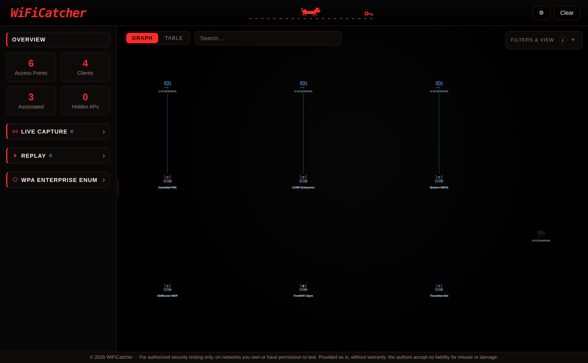

<div align="center">
  
  <p><em>A simplified tool for a fast Wi-Fi assessment, and an easy starting point for beginners.</em></p>
</div>

WiFiCatcher is an open-source tool for Wi-Fi reconnaissance. It brings the best-known tools (`airodump-ng`, `aireplay-ng`, `tshark`, `EAP_buster`) together behind a single visual interface, turning the wall of text they produce into an interactive map: every access point and client is a node, every association an edge.

<div align="center">
  
</div>

## 🏗️ Architecture

The app is split into two parts. The main **WiFiCatcher** app always runs as a normal, unprivileged user: a **FastAPI** backend (served by `uvicorn`, listening locally only) plus a browser frontend that draws the graph with **Cytoscape.js** (fCoSE layout). The few operations that need root, such as monitor mode, running `airodump-ng` and `aireplay-ng`, and restoring NetworkManager, are handed off to a small separate component, the **warden**. You install it once as a systemd socket-activated service, and from then on the system starts it on demand, so the app never runs as root. External tools are driven, not reimplemented or bundled: you install them and WiFiCatcher runs them as separate programs.

## 📡 Hardware requirements

Live capture and deauthentication need a Wi-Fi adapter that supports monitor mode and packet injection, which many built-in laptop adapters do not; a compatible external adapter is usually the safe choice. Everything else works on any machine, since it reads a capture file rather than the radio.

## 📥 Installation

```bash
git clone https://github.com/0xPR3ST1JH0NN7/WiFiCatcher
cd WiFiCatcher

# system tools
sudo apt install aircrack-ng tshark wpasupplicant

# Python dependencies (the app runs from this venv)
python3 -m venv .venv && source .venv/bin/activate
pip install -r requirements.txt

# install the privileged warden (once)
sudo ./packaging/install-warden.sh
```

## ▶️ Run

```bash
.venv/bin/python -m WiFiCatcher      # http://127.0.0.1:8000
```

At startup WiFiCatcher runs a small preflight and checks the warden is reachable: if it is missing, it refuses to start and points you back to the installer. Press **Enter** (or `Ctrl+C`) in the terminal to stop.

## ✨ What it does

WiFiCatcher is built around three ways of working. Whichever you use, the results share the same views: an interactive graph, a sortable and searchable table for busier scans, per-node details, and filters by type, encryption or channel.

### 📶 Live capture

Point it at a wireless interface and watch the map build in real time as access points and clients appear, each carrying its signal, channel, vendor, encryption, cipher, auth and WPS state. You handle the reconnaissance, fire targeted deauthentication at a client or an AP, and follow the attack paths suggested for each technology. Any WPA handshake that follows a deauth is detected and flagged automatically, and on WPA-Enterprise networks you watch RADIUS server certificates and captured domain users appear live.

### ⏯️ Replay

Load a saved `airodump-ng` CSV to go back over a past scan offline. Step through it node by node as if it were being discovered live, or jump straight to the full picture, with the same graph, table, details and attack paths as a live session.

### 🏢 Enterprise (802.1X)

For WPA-Enterprise networks WiFiCatcher gives you three tools: export the RADIUS server certificate, read usernames from a capture (such as `DOMAIN\user`), and run the EAP-method enumeration to see which methods a network accepts, followed live as they are tried.

## ⚖️ License

Licensed under the MIT License; see [LICENSE](LICENSE). The MIT license covers WiFiCatcher's own code only.

## 📦 Third-party software

WiFiCatcher drives well-known tools such as aircrack-ng, Wireshark's `tshark` and `wpa_supplicant`. You install those yourself and WiFiCatcher runs them as separate programs, so their licenses stay with them. See [THIRD_PARTY_NOTICES.md](THIRD_PARTY_NOTICES.md) for the full list.

## 👥 Authors

[@0xPR3ST1JH0NN7](https://github.com/0xPR3ST1JH0NN7), [@tvasari](https://github.com/tvasari)

## ⚠️ Disclaimer

WiFiCatcher is for authorized security testing and education only. Use it exclusively on networks you own or have explicit permission to test. It is provided as is, without warranty of any kind; the authors accept no responsibility or liability for any misuse or damage. You alone are responsible for complying with all applicable laws.
